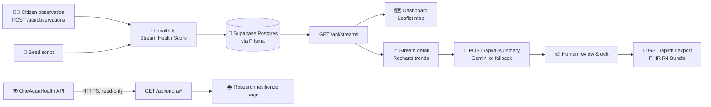

<div align="center">

# 🌊 StreamPulse

### *Every stream has a pulse. We help citizens hear it.*

**Citizen stream observations → Stream Health Score → interactive map, trends, AI One Health summaries and FHIR R4 export.**

<br/>

[](https://www.oneaquahealth.eu/)
[](#-track-alignment)

[](https://nextjs.org/)
[](https://www.typescriptlang.org/)
[](https://tailwindcss.com/)
[](https://www.prisma.io/)
[](https://supabase.com/)
[](https://ai.google.dev/)
[](https://leafletjs.com/)
[](https://hl7.org/fhir/R4/)

<br/>

[**Features**](#-features) · [**How it works**](#-how-it-works) · [**Quick start**](#-quick-start) · [**API**](#-api-reference) · [**Demo script**](#-demo-video-script-35-min)

</div>

---

## 💡 The problem

Citizen scientists collect a lot of useful data about local streams, including water clarity, pH, temperature, macroinvertebrates, pollution signs and habitat quality. **Most of it stays in spreadsheets.** It is hard to compare streams, spot trends or link water quality to **human and animal health**. It is even harder to share the data with health systems.

## ✨ The solution

**StreamPulse** turns raw field observations into **decisions people can act on**:

> 🧪 **Collect** → 📊 **Score** → 🗺️ **Visualize** → 🤖 **Explain** → ✍️ **Review** → 🏥 **Share**

Every observation becomes a transparent **0–100 Stream Health Score**. Scores appear on a live map and as trend charts. Gemini writes a plain-language **One Health** summary, a human reviews and edits it, and the result can be exported as a standard **HL7 FHIR R4** bundle that health and environmental systems can read.

---

## 🏆 Track alignment

<table>
<tr>
<td width="33%" valign="top">

### 📥 Data
Uses observations from citizen scientists and real research-site weather from the **OneAquaHealth API**.

</td>
<td width="33%" valign="top">

### 🔎 Insight
Uses a transparent weighted score, trend detection and **AI One Health summaries** of risks to people and animals.

</td>
<td width="33%" valign="top">

### 🤝 Action
Includes a **human-in-the-loop** editing step and **FHIR R4** export so other health systems can use the results.

</td>
</tr>
</table>

---

## 🚀 Features

| | Feature | Description |
|---|---|---|
| 🗺️ | **Interactive health map** | Leaflet map with color-coded stream markers, filters and summary cards. |
| 📈 | **Trend analytics** | Recharts time series with score tooltips. Streams are labeled **improving**, **stable** or **worsening**. |
| 🧮 | **Transparent scoring** | A clear weighted formula based on six ecological indicators. It is not a black box. |
| 🤖 | **Gemini One Health summaries** | Summaries under 90 words covering current status, risks to human and animal health, and recommended actions. |
| 🛟 | **Works without an API key** | If no Gemini key is set, the app uses a fixed rule-based summary so the demo still works offline. |
| ✍️ | **Human review** | AI summaries can be edited and saved, so a person checks the result before anyone acts on it. |
| 🏥 | **FHIR R4 export** | One-click `Bundle` with a `Location`, an `Observation` per record (UCUM units) and a `DiagnosticReport`. |
| 🌦️ | **Research resilience view** | Read-only HTTPS proxy to OneAquaHealth research sites and daily weather. |

---

## 🧠 How it works



### 🧮 The Stream Health Score

Each observation is scored from **0 to 100** as a weighted average of six sub-scores:

| Indicator | Weight | How it's scored |
|---|:---:|---|
| 🐛 Macroinvertebrates | **25%** | Index 0–10, scaled to 0–100 (pollution-sensitive taxa) |
| 💧 Water clarity | **20%** | % transparency |
| ⚗️ pH | **15%** | 100 inside **6.5–8.5**, then −25 per pH unit outside that range |
| 🚯 Pollution signs | **15%** | 100 − 25 for each visible sign (trash, odor, algae, oil sheen) |
| 🌿 Habitat | **15%** | Habitat assessment, 0–100 |
| 🌡️ Temperature | **10%** | 100 at **≤ 18 °C**, falling linearly to 0 at 30 °C (cool water holds more oxygen) |

<div align="center">

| 🟢 **Good** | 🟡 **Moderate** | 🔴 **Poor** |
|:---:|:---:|:---:|
| score ≥ 70 | 40 – 69 | < 40 |

</div>

**Trend detection:** the average of the latest 3 scores is compared with the 3 scores before them. A change of more than **±3 points** marks the stream as *improving* or *worsening*.

---

## ⚡ Quick start

### Prerequisites
- **Node.js** 18+
- A **Supabase** project (Postgres)
- *(Optional)* A **Google Gemini API key**

### 1. Install and configure

```bash
npm install
cp .env.example .env
```

### 2. Set environment variables

| Variable | Required | Description |
|---|:---:|---|
| `DATABASE_URL` | ✅ | Supabase **Transaction pooler** string (port `6543`, `pgbouncer=true`) |
| `DIRECT_URL` | ✅ | Supabase **direct** connection string (used for migrations) |
| `GEMINI_API_KEY` | ➖ | Turns on AI summaries. Without it, the rule-based fallback is used |
| `GEMINI_MODEL` | ➖ | Defaults to `gemini-3.5-flash` |
| `ENORA_API_BASE_URL` | ➖ | OneAquaHealth API origin. **Only HTTPS URLs are accepted** |

> [!TIP]
> If your network can't reach Supabase's direct connection, use the **session pooler** (port `5432`) for `DIRECT_URL` instead.

> [!IMPORTANT]
> Keep these values private. When you deploy to **Vercel**, set them as server-side environment variables.

### 3. Set up the database and run

```bash
npx prisma generate
npm run seed      # creates the schema and loads demo data, only if the DB is empty
npm run dev       # → http://localhost:3000
```

### 📜 Scripts

| Command | What it does |
|---|---|
| `npm run dev` | Starts the dev server |
| `npm run build` | Generates the Prisma client and builds for production |
| `npm run db:push` | Applies the Prisma schema to the database |
| `npm run seed` | Loads the **5-stream, 70-observation** demo dataset, *only if the DB is empty* |
| `npm run seed:reset` | ⚠️ **Deletes all streams and observations**, then reloads the demo data |

---

## 🔌 API reference

| Method | Endpoint | Purpose |
|:---:|---|---|
| `GET` | `/api/streams` | All streams with latest score, status and trend |
| `GET` | `/api/streams/[id]` | One stream with its full observation history |
| `POST` | `/api/observations` | Submit an observation (scored automatically when saved) |
| `POST` | `/api/ai-summary` | Generate a One Health summary (Gemini or fallback) |
| `GET` | `/api/fhir/export?streamId=` | Download a FHIR R4 `Bundle` for a stream |
| `GET` | `/api/enora/sites` | OneAquaHealth research sites (read-only proxy) |
| `GET` | `/api/enora/weather` | Daily weather for a research site (read-only proxy) |

<details>
<summary><b>🏥 What's inside the FHIR bundle?</b></summary>

<br/>

```text
Bundle (type: collection)
├── Location            → stream name, description, lat/lng
├── Observation × N     → category "survey", one per citizen record
│   └── components      → clarity (%), pH ([pH]), temperature (Cel),
│                         macroinvertebrate index, pollution signs,
│                         habitat score, StreamPulse Health Score
└── DiagnosticReport    → human-reviewed One Health summary (if saved)
```

Units use **UCUM** (`http://unitsofmeasure.org`). pH is also tagged with a **LOINC** code.

</details>

---

## 🌦️ Research resilience

The **`/resilience`** page shows OneAquaHealth research sites and lets you pick a site and a date range to see **daily weather**.

- 🔒 Uses HTTPS only. HTTP origins are rejected.
- 👀 It is read-only and **never changes StreamPulse scores**.
- 🛟 If the upstream service is down, the page shows a temporary data error instead of failing.

**Join the wider OneAquaHealth community:**

- 🗺️ [OneAquaHealth Resilience Map](https://apps.oneaquahealth.eu/resmap/), with the full indicator set
- 👥 [OneAquaHealth Community](https://www.oneaquahealth.eu/community/), where you join first
- 📱 [Citizen Science App](https://apps.oneaquahealth.eu/login), for submitting your own observations

---

## 🗂️ Project structure

```text
streampulse/
├── prisma/
│   ├── schema.prisma        # Stream & Observation models
│   └── seed.ts              # Demo dataset (5 streams, 70 observations)
└── src/
    ├── app/
    │   ├── page.tsx         # 🗺️ Dashboard
    │   ├── stream/[id]/     # 📈 Stream detail + AI summary + FHIR export
    │   ├── resilience/      # 🌦️ OneAquaHealth research view
    │   ├── about/           # ℹ️ About page
    │   └── api/             # 🔌 Route handlers
    ├── components/
    │   ├── StreamMap.tsx    # Leaflet map
    │   └── ui/              # shadcn/ui primitives
    └── lib/
        ├── health.ts        # 🧮 Scoring, status, trend
        ├── ai.ts            # 🤖 Gemini + fallback summaries
        ├── fhir.ts          # 🏥 FHIR R4 bundle builder
        ├── enora.ts         # 🌍 OneAquaHealth API client
        └── db.ts            # Prisma client
```

> [!NOTE]
> UI components come from **shadcn/ui** (`components.json` is included). Add more with `npx shadcn@latest add <name>`.

---

## 📸 Screenshots

| Dashboard | Stream detail |
|:---:|:---:|
|  |  |

<sub>Run the app locally, then save screenshots to `docs/dashboard.png` and `docs/detail.png`.</sub>

---

## 🎬 Demo video script (3–5 min)

| ⏱️ Time | Scene |
|:---:|---|
| `0:00` | **The problem:** citizen data is rich but hard to act on. |
| `0:30` | **Dashboard:** color-coded map, filters and summary cards. |
| `1:15` | **Trends:** open *Harbor Run* (improving) and *Quarry Creek* (worsening). Show the chart and score tooltip. |
| `2:15` | **AI + human:** generate the Gemini summary, edit it and save it. |
| `3:00` | **Interoperability:** download the FHIR bundle and show the `Location` and `Observation` resources. |
| `3:45` | **Impact and scale:** FHIR connects citizen science to health and environmental systems. |

---

## 🛣️ Roadmap

- [ ] 📱 Mobile-first observation form with photo upload
- [ ] 🔔 Alerts when a stream changes to *worsening*
- [ ] 🔗 Push FHIR bundles straight to a FHIR server
- [ ] 🌍 Multi-language AI summaries for local communities

---

<div align="center">

### 💙 Built for the **OneAquaHealth IEEE Global Hackathon 2026**

*Healthy streams, healthy animals, healthy people. **One Health.***

<sub>Made with 🌊 by the StreamPulse team</sub>

</div>
